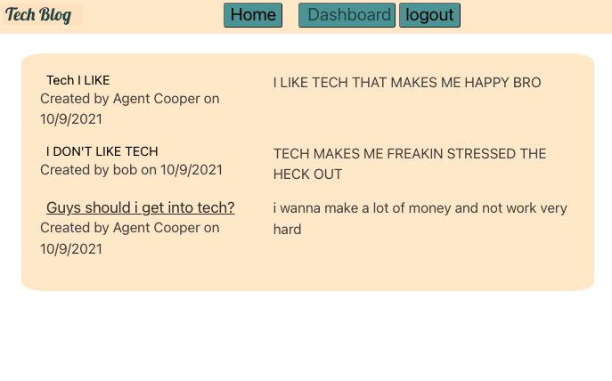

# MyVeryCool-blog

## Deployed 

https://safe-waters-86738.herokuapp.com/
## Videos

## Motivation

This project was motivating to really dive into the Model View Controller method. Learning how to create a dynamic page with user input will be very beneficial skill to have as it is part of most websites.

## Your Task

Model view controller method we talk to the server created get post put an delete routes we use models to set up the data that we needed to pass.
For views we used handlebars to dynamically pass information to a page that was created by our user. Controller is where we had our routes to direct user input to the proper place by either posting it putting it or deleting it.

## User Story

I wanted to make a blog where users could talk about tech and make comments to each other. The comment feature could enable them to ask questions about tag get opinions from others and share their knowledge.

## Technologies Used

* HTTP Methods GET POST PUT DELETE 
* Model View Controllers 
* Handlebars
* MySql 
* Express 
* Node Modules

